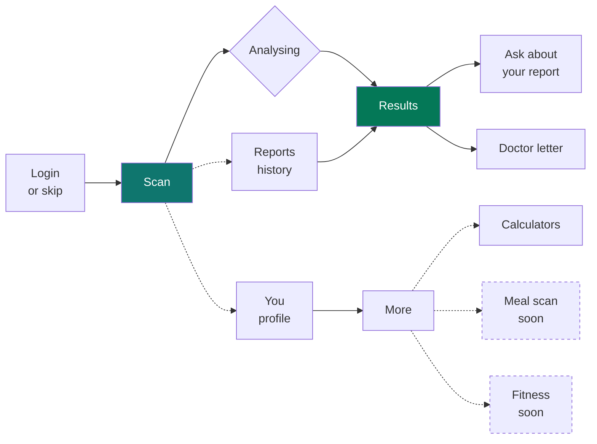
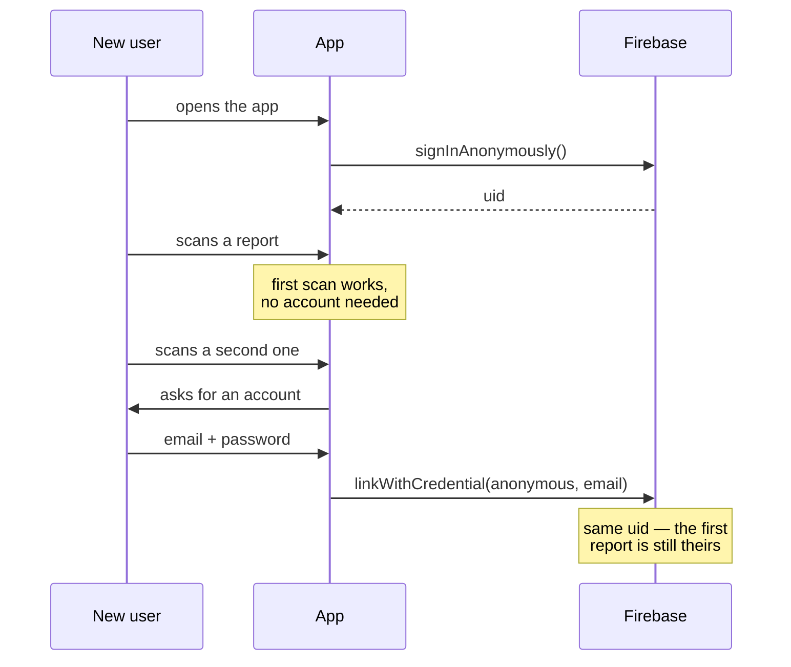

# 🩸 Blood Lab — Android app

**Your lab gives you numbers. Blood Lab gives you sentences.**

Photograph a blood report, get every marker explained in plain English. Built with
React Native and Expo, sharing a backend with
[the web app](https://github.com/nazsats/blood-report-analyzer) at
[www.bloodlab.in](https://www.bloodlab.in).

> **Status:** in closed testing on Google Play. Package `com.bloodai.app` — the
> old name, kept because an Android package id is permanent once uploaded and is
> never shown to users.

---

## What it does

The app does one thing well and keeps everything else out of the way.

| | Step | What happens |
|---|---|---|
| **1** | **Scan** | Photograph the report, pick an image, or choose a PDF |
| **2** | **Analyse** | The backend runs GPT-4.1 over it and writes the result to Firestore |
| **3** | **Read** | Every marker, what is high or low, why, and what to do about it |

For each test you get what it measures in everyday words, whether your value is
normal, and — if it is not — the likely causes and a specific plan that
references your actual number. Across the whole report: a health score, early
warnings from patterns across markers, medication interaction flags, and food
and lifestyle guidance tied to your results.

You can also ask follow-up questions about your own report, and keep a history to
compare against next time.

---

## How the screens fit together



**Three tabs, not six.** The app used to open on a dashboard with six tabs, which
buried the one thing people install it for. Scanning is now the first screen.
Everything else moved behind **More**, and the features that are not finished are
labelled *Coming soon* instead of half-working.

| Tab | Route | What it is |
|---|---|---|
| **Scan** | `(tabs)/upload` | The home screen. Camera, gallery, or PDF |
| **Reports** | `(tabs)/history` | Every report you have analysed |
| **You** | `(tabs)/profile` | Age, blood type, medications — context that improves the analysis. Community feed lives here |

Routes kept but hidden with `href: null` — reachable by link, not by tab:
`home`, `chat`, `feed`. Standalone screens: `ai-chat`, `calculators`, `more`,
`meal-scan`, `fitness`, `weight-tracker`, `results/[id]`.

---

## Sign in later, not first



Asking someone to register before they have seen the product costs more installs
than it saves. The first scan runs against an anonymous Firebase user; when they
do create an account, `linkWithCredential` upgrades that same uid, so the report
they already have does not vanish at the moment they sign up.

---

## Tech stack

| Category | Choice | Why |
|---|---|---|
| **Framework** | React Native 0.81, Expo **SDK 54** | Pinned to 54 because Expo Go ships exactly one SDK, and moving ahead of it breaks testing on a real phone |
| **Routing** | Expo Router 6 | File-based, so the folder tree is the navigation graph |
| **Language** | TypeScript 5.9 | |
| **Design** | Light theme, teal `#0F766E`, Plus Jakarta Sans | Replaced a dark violet theme and a motorsport display font. This is a medical product read by people who are worried |
| **Auth** | Firebase Auth, anonymous → linked | See above |
| **Data** | Cloud Firestore | Same project as the web app, so a report scanned on the phone opens on the web |
| **Analysis** | Shared Next.js backend, **gpt-4.1** | The API key never ships inside the app |
| **Camera & files** | `expo-image-picker`, `expo-document-picker` | |
| **Animation** | Reanimated 4, Gesture Handler | |
| **Builds** | EAS Build → AAB | |

### Decisions worth knowing

- **Permissions are subtracted, not just omitted.** Expo's autolinking re-adds
  `RECORD_AUDIO` and location from transitive dependencies, so `app.json` lists
  them under `blockedPermissions`. A blood report app asking for your microphone
  is a Play Store review problem and a trust problem.
- **The API key lives on the server.** The app talks to the Next.js backend, not
  to OpenAI. Anything shipped in an APK is readable by anyone who downloads it.
- **`babel-preset-expo` has to track the SDK.** `expo install --fix` does not
  touch devDependencies, so it can sit a major version ahead and produce build
  failures that read as unrelated.

---

## Running it

### You will need

- Node 18+
- The **Expo Go** app, or a development build
- A Firebase project with Authentication (anonymous + email/password) and Firestore
- The [Next.js backend](https://github.com/nazsats/blood-report-analyzer) running
  locally or deployed

### Setup

```bash
git clone https://github.com/nazsats/ai-blood-report-mobile.git
cd ai-blood-report-mobile
npm install
```

Create `.env` in the project root:

```env
EXPO_PUBLIC_FIREBASE_API_KEY=your_api_key
EXPO_PUBLIC_FIREBASE_AUTH_DOMAIN=your_auth_domain
EXPO_PUBLIC_FIREBASE_PROJECT_ID=your_project_id
EXPO_PUBLIC_FIREBASE_STORAGE_BUCKET=your_storage_bucket
EXPO_PUBLIC_FIREBASE_MESSAGING_SENDER_ID=your_sender_id
EXPO_PUBLIC_FIREBASE_APP_ID=your_app_id

# Your machine's LAN IP, not localhost — localhost on a phone means the phone.
EXPO_PUBLIC_API_URL=http://192.168.1.x:3000
```

```bash
npx expo start
```

Scan the QR code with Expo Go.

**If the QR code fails**, check the SDK first. Expo Go supports exactly one SDK
version at a time, and the error it gives you for a mismatch does not say so.
`npx expo config --type public | grep sdkVersion` against the version Expo Go
reports in its own UI.

### Release build

```bash
npx eas build --platform android --profile production
```

Produces an AAB for Play Console. Build from `main` — building from a stale
branch produces an installable, working, months-old app, which is a hard mistake
to spot after the fact.

---

## Project layout

```
ai-blood-report-mobile/
├── app/
│   ├── (auth)/            # Login and registration
│   ├── (tabs)/            # Scan, Reports, You — plus hidden home/chat/feed
│   ├── results/[id].tsx   # Analysis results
│   ├── more.tsx           # Everything not core
│   ├── ai-chat.tsx        # Questions about your report
│   ├── calculators.tsx    # BMI, TDEE, hydration, macros
│   ├── meal-scan.tsx      # Coming soon
│   ├── fitness.tsx        # Coming soon
│   └── weight-tracker.tsx # Coming soon
├── lib/
│   ├── firebaseClient.ts  # Firebase init
│   ├── guestAuth.ts       # Anonymous sign-in and account linking
│   └── healthData.ts      # Report parsing helpers
├── constants/
│   ├── colors.ts          # LIGHT and DARK palettes
│   └── fonts.ts           # Plus Jakarta Sans
└── assets/                # Icons, splash, fonts
```

---

## ⚠️ Not medical advice

Blood Lab explains what your results say. It is not a diagnosis and does not
replace your doctor. Do not use it to make a medical decision on your own, and if
something looks serious, speak to a professional.

---

## License

Proprietary. All rights reserved.
